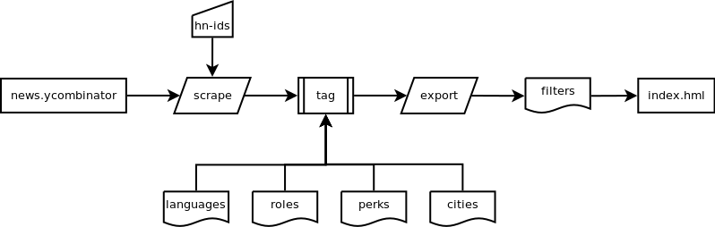

Title: HN-Hiring Dashboard
Date: 2018-03-13 12:40
Modified: 2018-03-13 12:40
Category: Code
Tags: Python, HTML, JS, code, side-project
Slug: hn-hiring-filters
Authors: Nicolás Bohórquez
Summary: Some of my colleages in the [MADAS](http://madas.carloalberto.org) program are not developers, but, i think that they might be interested in the Hacker News job offers, let's try to help them find the proper company by easing the job search with python, html, js, vue and elasticlunr.
Status: published

This simple [dashboard](http://hn.nicolasbohorquez.com) is based on Hacker News' _Who is hiring_ posts. The simple scraper python file download and parse the html text, then a tagging process try to identify common aspects of the post (cities, programming languages, roles, perks) and export the result as a csv file ready to be rendered as a simple vue.js application.

The _index.html_ file renders some filters and dc.js charts from the _filters.csv_ datasource. A simple _elasticlunr.js_ index is used to provide basic full text search. Maybe a digram would help to illustrate the idea:



## Installation

The python dependencies can be installed using _pip_:

```
pip install -r requirements.txt
```

to run the scraper and generate a valid _filters.csv_ file from the January, February and March (2018) posts:

```
python hn_hiring_scraper.py 16052538 16492994 16282819
```

### The tags sources

To tag each post some static lists are included:
- Programming languages from [Tiobe index](https://www.tiobe.com/tiobe-index/) (consulted march 2018)
- Cities from [WorldAtlas](https://www.worldatlas.com/citypops.htm)
- IT Roles from [The Balance](https://www.thebalance.com/list-of-information-technology-it-job-titles-2061498) with some Data Science additions

### Why is not R included in the programming languages?

Currently the tagging process is veeeery simple, given that _R_ is a single letter it lead to tag _every_ post i preferred to avoid it. I am working on that...no promises.

## What i get from this?

Fun. Some knowledge -i spent a lot of time remembering how to do some simple stuff in python and javascript-, and some _new_ knowledge -Vue.js-.

## TODO

- Document the code and improve README.md fle
- Optimize js imports (_why dc.min.js breaks the rowChart order?_)
- Improve post rendering
- Add topic modeling for the scraper and to the filters
- Add _undo search_
- Improve performance
